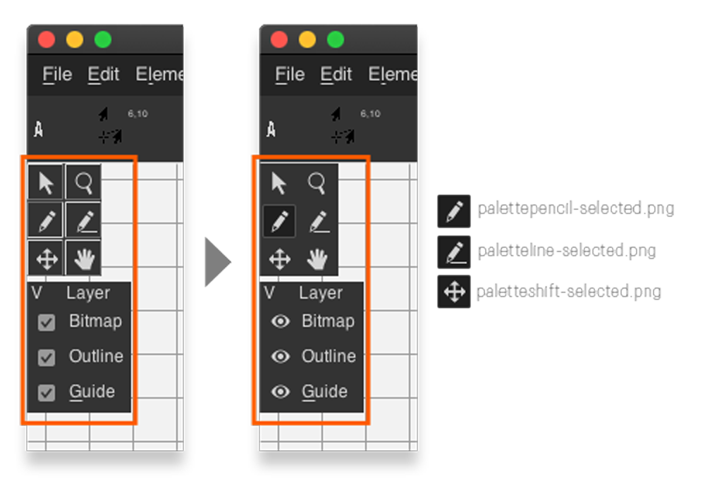
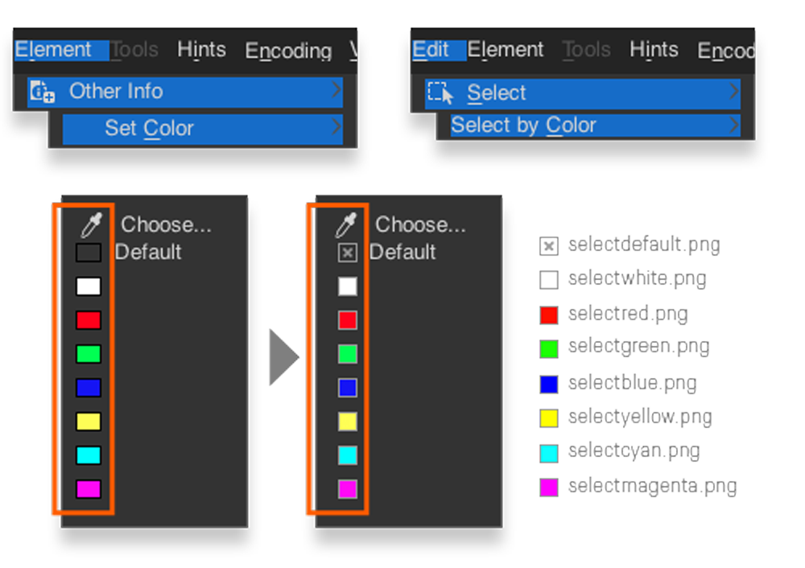
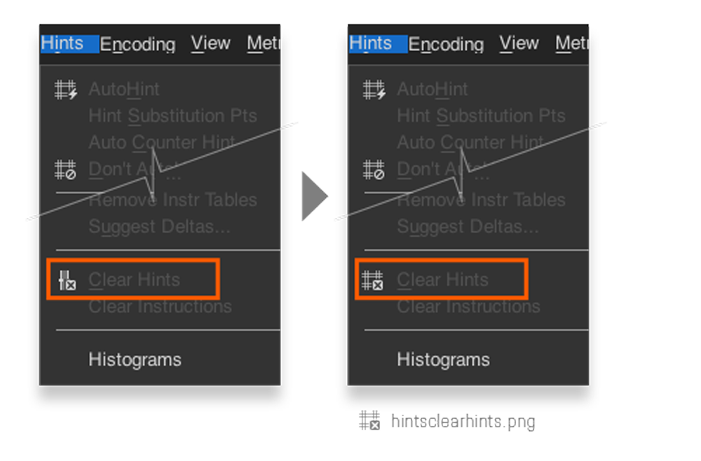
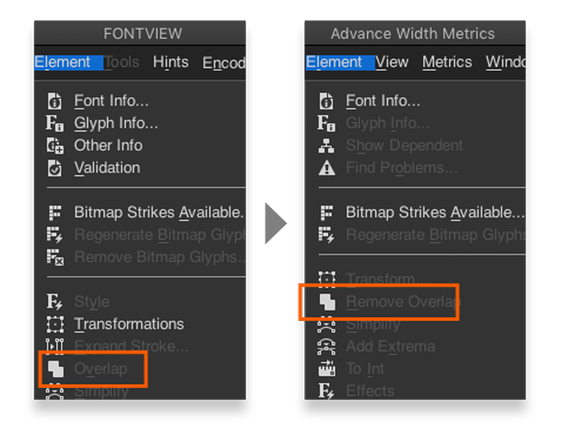
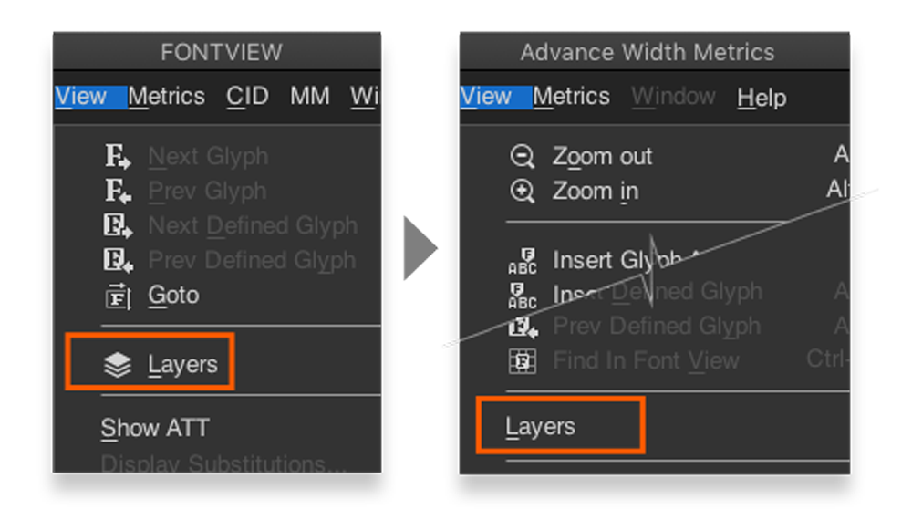
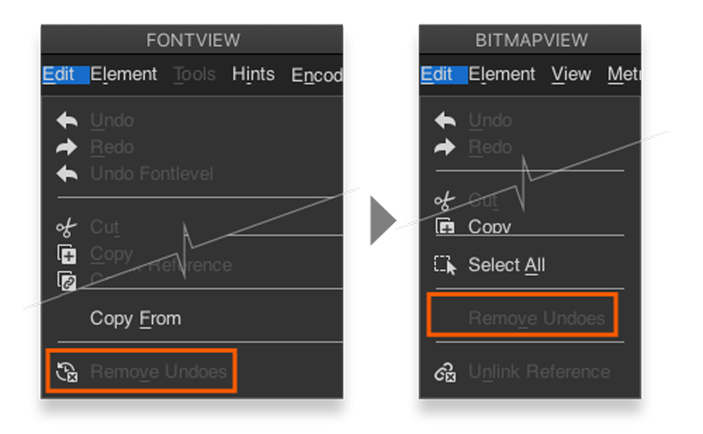
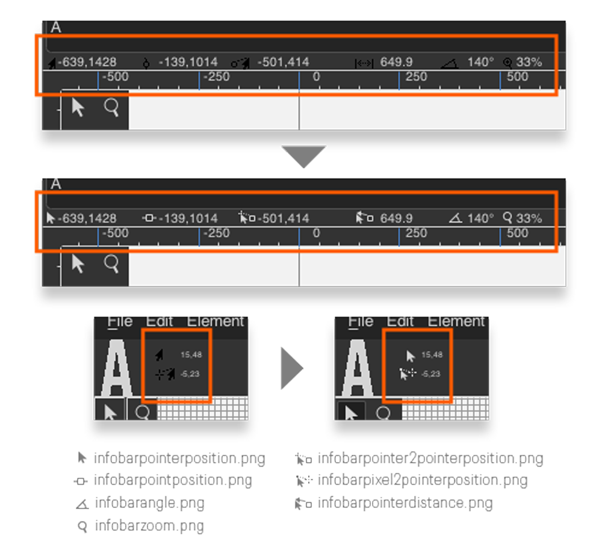
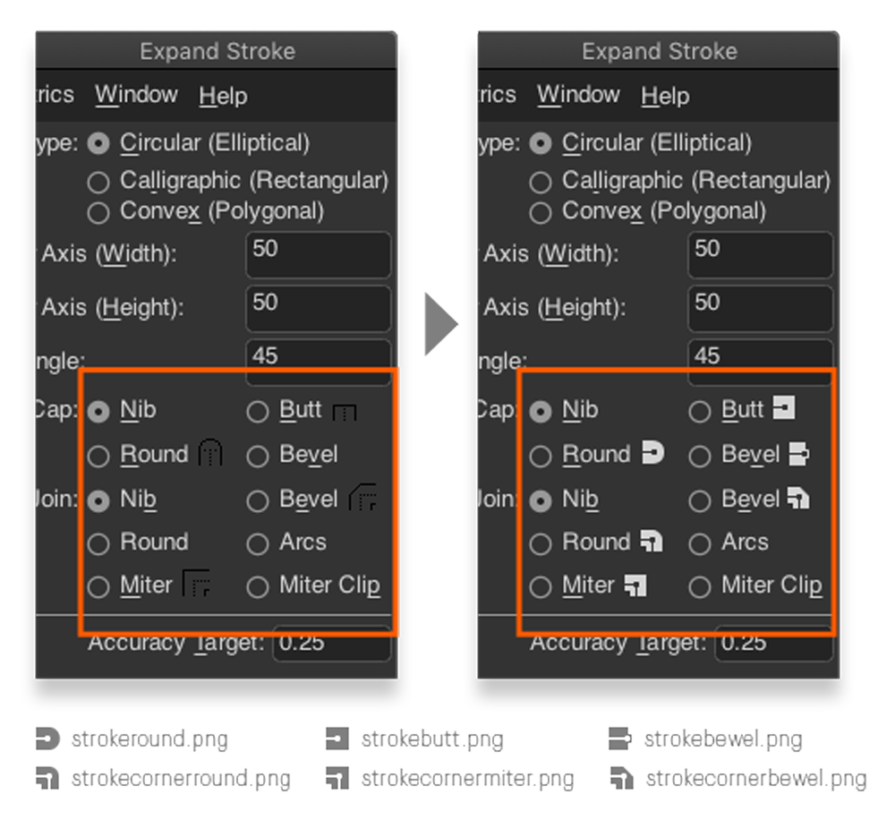

# zThemes Improvements

> [!NOTE]
> All new icons for **`zDark`** and **`zLight`** are included in the **`New-Icons.zip`** file.

During **`zThemes`** development—from the initial **`zDark`** through the final **`zLight`** revision—I discovered several enhancements that could improve FontForge's theme customization system. Though time-intensive, these changes would significantly benefit future theme developers.

## Unify tool palettes appearance and behavior

The tool pallets on the BitmapView should have the same appearance and behavior as the ones on the OutlineView.

## Correct some icons usages and drop using duplicate icons

Make and share use of the icon files for the menus options `Set Color` and `Select by Color`

Set a different icon file (hintsclearhints.png) for the menu option `Clear Hints`

Set the same icon file (overlaprm.png) to the menu option `Remove Overlap` in MetricsView (this option is currently using a duplicated icon file rmoverlap.png).

Below a list of files icnos that seem not used:

|    changeweight.png    |  fileclose2.png  |    paletteselectedbg.png    |
|:----------------------:|:----------------:|:---------------------------:|
| elementtilepath.png    | fliphor.png      | palettespirodisabled.png    |
| elementtilepattern.png | flipvert.png     | palettespiroup-selected.png |
| exclude.png            | inline.png       | rotate180.png               |
| extendcondense.png     | intersection.png | rotateccw.png               |
| fflogo.png             | oblique.png      | rotatecw.png                |
| fflogo13.png           | outline.png      | shadow.png                  |
| ffsplash1.png          | text12210.png    | skew.png                    |
| ffsplash2.png          | wireframe.png    | splash2019.png              |
| ffsplash3.png          |                  | rmoverlap.png*              |

> `rmoverlap.png` is in use, but is duplicate of `overlaprm.png`

## Apply the same icon for the same options on all views

Apply icon file viewlayers.png to `Layers` menu option on MetricsView.

Apply icon file editrmundoes.png to `Remove Undoes` on BitmapView.

## Enable new interface icon customization

Apply new custom icons for the pointer and point indicators on the info bar in the CharView and the BitmapView.

Replace and add new custom icons for `Expand Stroke` dialog.

---

[Released under MIT License](https://github.com/adolfo-ovalles/zThemes/blob/941fb1096e81c23282a2dec6c4c4e3698c5104c5/LICENSE) © 2025 Adolfo Ovalles.
