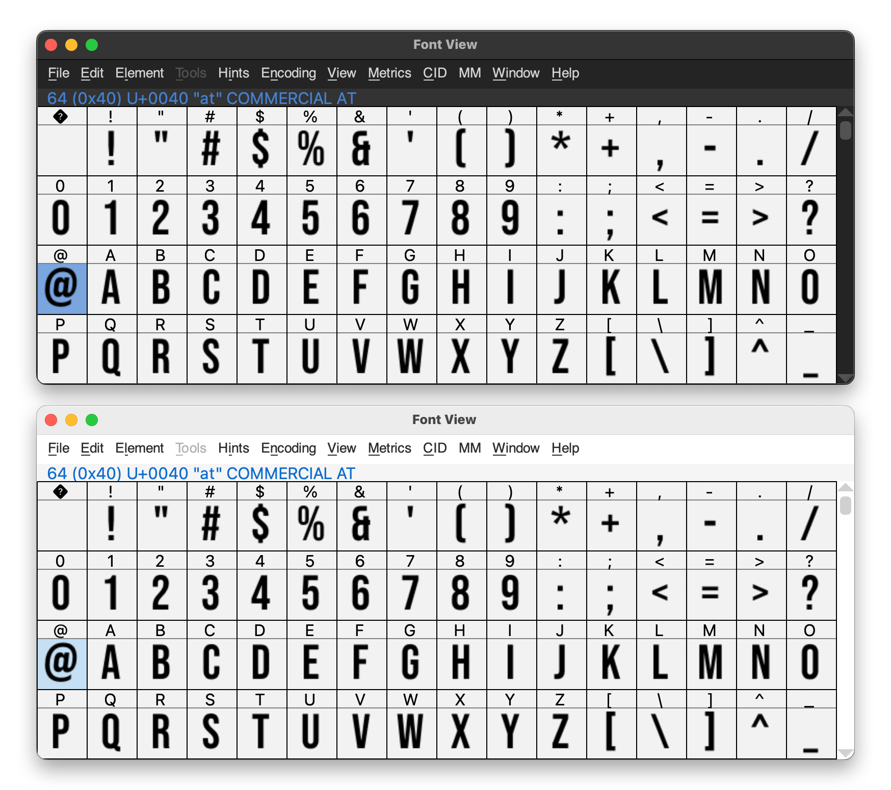
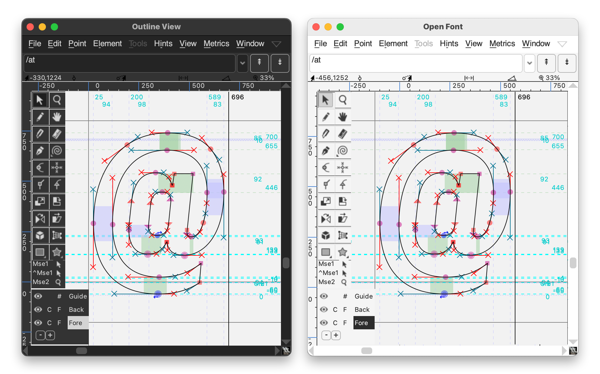
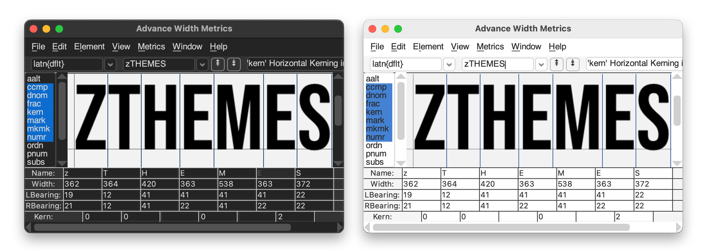
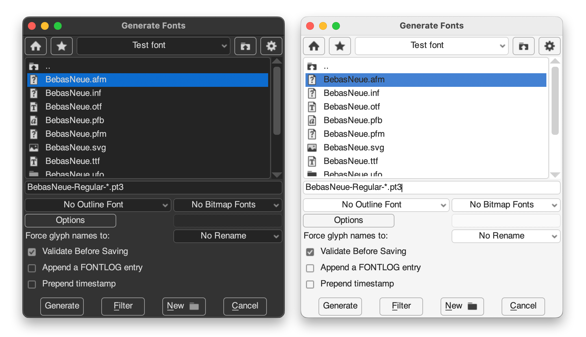
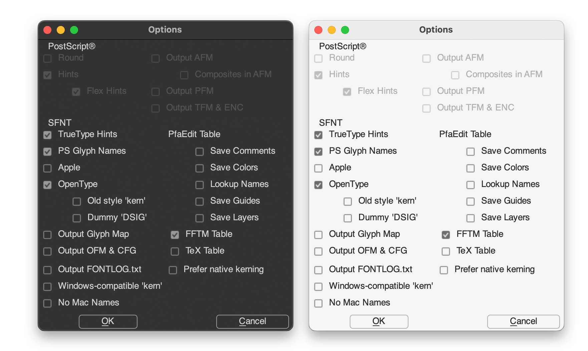

# zThemes for FontForge

**zThemes** are a comprehensive visual update for [FontForge](http://fontforge.github.io/) that includes both **`zDark`** and **`zLight`** themes, offering a complete dark/light mode experience inspired by Adobe's color palettes. These themes feature modern, comfortable color schemes with improved contrast and readability.

Created by [Adolfo Ovalles](https://www.behance.net/adolfo_ovalles)

## Features

☑️ **Dual color palettes** inspired by Adobe apps' dark and light modes. 
☑️ **310 rebuilt icons,** including Debug dialog icons. 
☑️ **Pixel-perfect adjustments** for optimal clarity at native FontForge render size (72dpi). 
☑️ **Cleaned pixmaps folder** containing only tested icons and required files. 
☑️ **Legacy icon set** included in a separate folder for backwards compatibility. 
☑️ **25 extra icons** to support suggested improvements in future FontForge releases.

## Installation

> [!WARNING]
> Back up your current **`pixmaps`** folder before installing. This allows you to restore the original theme if needed.

1. Download the desired them **`zDark.zip`** or **`zLight.zip`** and extract it.

2. Locate your FontForge pixmaps folder: 

    <pre>
    📂 Win → C:\Program Files (x86)\FontForgeBuilds\share\fontforge\pixmaps  
    📂 Mac → /Applications/FontForge.app/Contents/Resources/opt/local/share/fontforge/pixmaps  
    📂 UNIX → /usr/share/fontforge/pixmaps`
    </pre>

3. Copy the contents of the **`pixmaps`** folder from the extracted zTheme and overwrite your FontForge **`pixmaps`** folder.

4. Launch FontForge, go to **File → Preferences → Generic → ResourceFile.**

5. Browse to and select either: 

    <pre>
    zDark.theme ➡️ for dark mode. 
    zLight.theme ➡️ for light mode.
    </pre>

6. Restart FontForge to apply the theme.

## Screenshosts

## Suggested Improvements

During development, I identified several enhancements that would improve zThemes' integration with FontForge. However, these require programming knowledge beyond my skill set and would need to be implemented in future [FontForge](http://fontforge.github.io/) releases.

### Detailed Technical Notes

* [IMPROVEMENTS.md](Improvements/IMPROVEMENTS.md) — Full documentation of proposed enhancements
* [FontForge Discussion #4757](https://github.com/fontforge/fontforge/discussions/4757) — Community discussion thread

Developers interested in contributing to FontForge are welcome to explore these ideas!

## Source Files

To support community contributions, the repository provides [PSD source files release](https://github.com/adolfo-ovalles/zThemes/releases) containing all original icon shapes, fully editable layers, and pre-configured layer comps with export filenames.

> [!NOTE]
> The source files ensure **zThemes** can continue to grow with FontForge, even without my direct involvement.

---
[Released under MIT License](https://github.com/adolfo-ovalles/zThemes/blob/941fb1096e81c23282a2dec6c4c4e3698c5104c5/LICENSE) © 2021–2025 Adolfo Ovalles.
