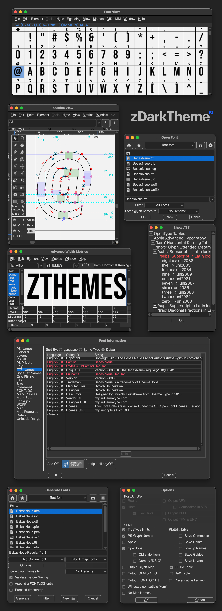

# zDarkTheme for FontForge

A true dark theme for [FontForge](http://fontforge.github.io/) inspired by Adobe's dark mode interface. Carefully crafted to provide a comfortable, modern editing experience with reduced eye strain.

Created by [Adolfo Ovalles](https://www.behance.net/adolfo_ovalles)

## Installation

> [!WARNING]
> Back up your current **`pixmaps`** folder before installing. This allows you to restore the original theme if needed.

1. Extract **`zDark.zip`**

2. Locate your FontForge **`pixmaps`** folder: 

    <pre>
    📂 Win → C:\Program Files (x86)\FontForgeBuilds\share\fontforge\pixmaps  
    📂 Mac → /Applications/FontForge.app/Contents/Resources/opt/local/share/fontforge/pixmaps  
    📂 UNIX → /usr/share/fontforge/pixmaps`
    </pre>

3. Copy the contents of the **`pixmaps`** folder from the extracted **`zDark`** and overwrite your FontForge **`pixmaps`** folder

4. Launch FontForge, go to **File → Preferences → Generic → ResourceFile.**

5. Browse to and select: **`zDark.theme`**

6. Restart FontForge to apply the theme.

___

### ‼️IMPORTANT‼️ Restoring Original Settings

If you have no backup or lost the original pixmaps, rename **`pixmaps-legacy`** from the extracted zDark folder to **`pixmaps`** and replace the one in your FontForge location.

> [!NOTE]
> **Pixmaps-legacy** is a backup from FontForge 2025-10-09 release</pre>

___

## Screenshosts

___

[Released under MIT License](https://github.com/adolfo-ovalles/zThemes/blob/941fb1096e81c23282a2dec6c4c4e3698c5104c5/LICENSE) © 2025 Adolfo Ovalles.
